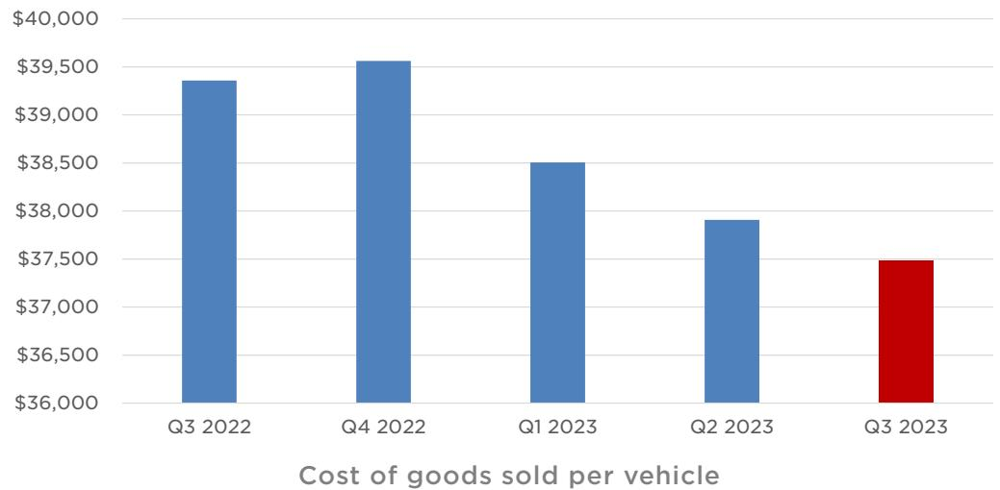
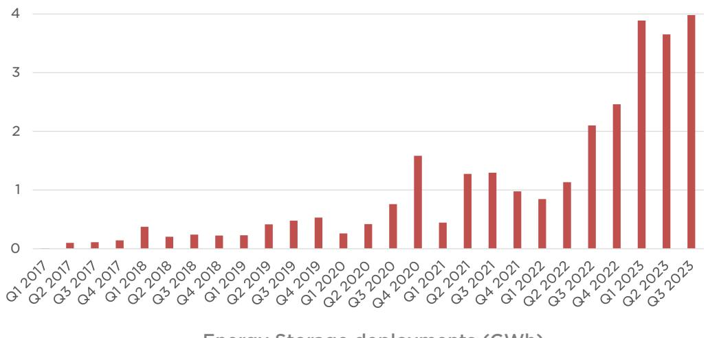
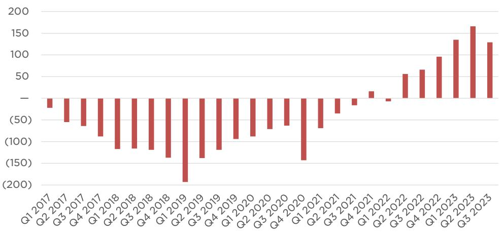
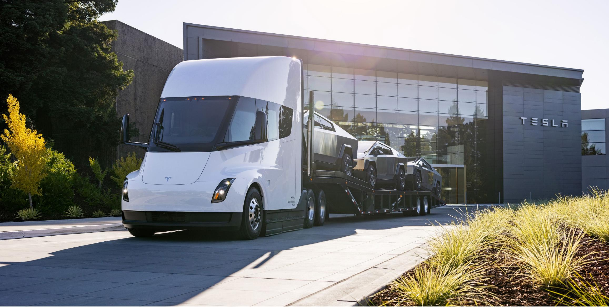
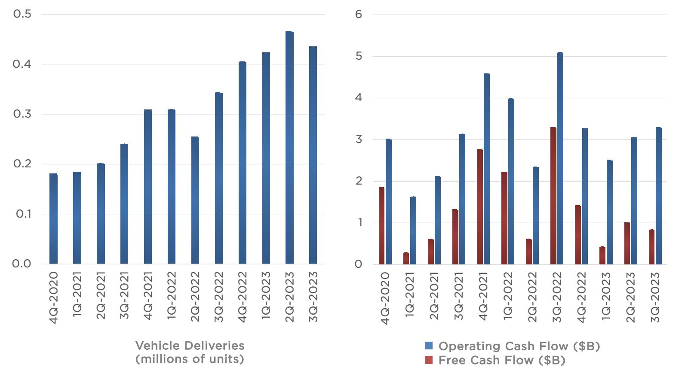
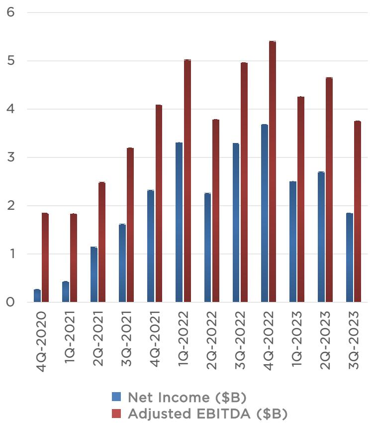
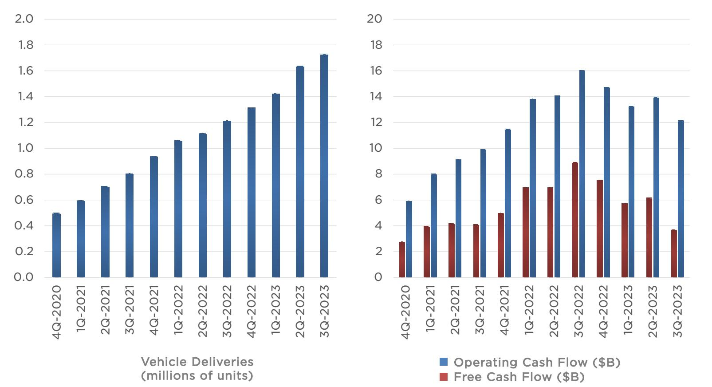
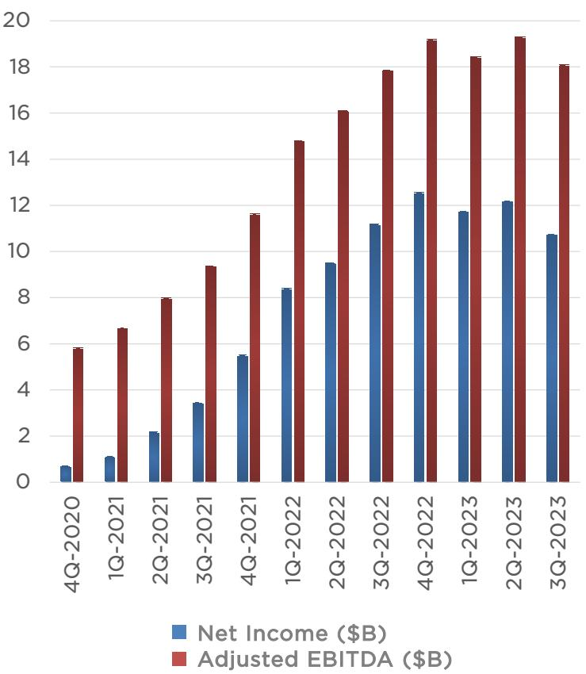
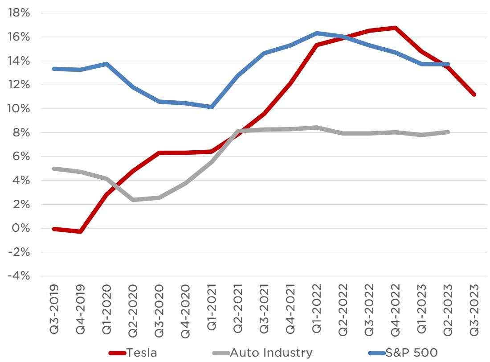

# Q3 2023 Update

#

#

Highlights 03   
Financial Summary 04   
Operational Summary 06   
Vehicle Capacity 07   
Core Technology 08   
Other Highlights 09   
Outlook 10   
Photos & Charts 11   
Key Metrics 16   
Financial Statements 19   
Additional Information 25

#

H I G H L I G H T S

Profitability 7.6% operating margin in Q3 \$1.8B GAAP operating income in Q3 \$1.9B GAAP net income in Q3 \$2.3B non-GAAP net income1 in Q3

Operating cash flow of \$3.3B in Q3   
Free cash flow2 of \$0.8B in Q3   
\$3.0B increase in our cash and investments3 QoQ to \$26.1B

Our main objectives remained unchanged in Q3-2023: reducing cost per vehicle, free cash flow generation while maximizing delivery volumes and continued investment in AI and other growth projects.

Our cost of goods sold per vehicle4 decreased to \~\$37,500 in Q3. While production cost at our new factories remained higher than our established factories, we have implemented necessary upgrades in Q3 to enable further unit cost reductions. We continue to believe that an industry leader needs to be a cost leader.

During a high interest rate environment, we believe focusing on investments in R&D and capital expenditures for future growth, while maintaining positive free cash flow, is the right approach. Year-to-date, our free cash flow reached \$2.3B while our cash and investments position continues to improve.

We have more than doubled the size of our AI training compute to accommodate for our growing dataset as well as our Optimus robot project. Our humanoid robot is currently being trained for simple tasks through AI rather than hard-coded software, and its hardware is being further upgraded.

Lastly, with a combined gross profit generation of over \$0.5B in Q3, our Energy Generation and Storage business and Services and Other business have become meaningful contributors to our profitability.

<table><tr><td>($ in millions, except percentages and per share data)</td><td>Q3-2022</td><td>Q4-2022</td><td>Q1-2023</td><td>Q2-2023</td><td>Q3-2023</td><td>YoY</td></tr><tr><td>Total automotive revenues</td><td>18,692</td><td>21,37</td><td>19,963</td><td>21,268</td><td>19,625</td><td>5%</td></tr><tr><td>Energy generation and storage revenue</td><td>1,117</td><td>1310</td><td>1,529</td><td>1.509</td><td>1.559</td><td>40%</td></tr><tr><td>Services and other revenue</td><td>1,645</td><td>1,701</td><td>1,837</td><td>2,150</td><td>2,166</td><td>32%</td></tr><tr><td></td><td></td><td></td><td></td><td></td><td></td><td></td></tr><tr><td>Total revenues</td><td>21,454</td><td>24,318</td><td>23,329</td><td>24,927</td><td>23,350</td><td>9%</td></tr><tr><td>Total gross profit</td><td>5,382</td><td>5,777</td><td>4,511</td><td>4,533</td><td>4,178</td><td> -22%</td></tr><tr><td>Total GAAP gross margin</td><td>25.1%</td><td>23.8%</td><td>19.3%</td><td>18.2%</td><td>17.9%</td><td>-719 bp</td></tr><tr><td></td><td></td><td></td><td></td><td></td><td></td><td></td></tr><tr><td>Operating expenses Income from operations</td><td>1,694</td><td>1,876</td><td>1.847</td><td>2,134</td><td>2,414</td><td>43%</td></tr><tr><td>Operating margin</td><td>3,688</td><td>3,901</td><td>2,664</td><td>2.399</td><td>1,764</td><td>-52%</td></tr><tr><td></td><td>17.2%</td><td>16.0%</td><td>11.4%</td><td>9.6%</td><td>7.6%</td><td>-964 bp</td></tr><tr><td>Adjusted EBITDA</td><td>4,968</td><td>5,404</td><td>4,267</td><td></td><td></td><td></td></tr><tr><td>Adjusted EBITDA margin</td><td>23.2%</td><td>22.2%</td><td>18.3%</td><td>4,653 18.7%</td><td>3,758</td><td> -24%</td></tr><tr><td></td><td></td><td></td><td></td><td></td><td>16.1%</td><td>-706 bp</td></tr><tr><td>Net income atributable to common stockholders (GAAP)</td><td>3,292</td><td>3,687</td><td>2.513</td><td>2.703</td><td>1.853</td><td> -44%</td></tr><tr><td>Net income atributable to common stockholders (non-GAAP)</td><td>3,654</td><td>4,106</td><td>2.931</td><td>3,148</td><td>2.318</td><td>-37%</td></tr><tr><td></td><td></td><td></td><td></td><td></td><td></td><td></td></tr><tr><td>EPS atributable to common stockholders, diluted (GAAP)</td><td>0.95</td><td>1.07</td><td>0.73</td><td>0.78</td><td>0.53</td><td> -44%</td></tr><tr><td>EPS attributable to common stockholders, diluted (non-GAAP)</td><td>1.05</td><td>1.19</td><td>0.85</td><td>0.91</td><td>0.66</td><td>-37%</td></tr><tr><td></td><td></td><td></td><td></td><td></td><td></td><td></td></tr><tr><td>Net cash provided by operating activities Capital expenditures</td><td>5,100</td><td>3,278</td><td>2.513</td><td>3,065</td><td>3,308</td><td>-35%</td></tr><tr><td>Free cash flow</td><td>(1.803) 3,297</td><td>(1.858)</td><td>(2.072) 441</td><td>(2.060) 1,005</td><td>(2,460) 848</td><td>36%</td></tr><tr><td>Cash, cash equivalents and investments</td><td>21,107</td><td>1,420 22,185</td><td>22,402</td><td>23,075</td><td>26,077</td><td>-74% 24%</td></tr></table>

# Revenue

Total revenue grew $9 \%$ YoY in Q3 to $\$ 23,45$ . YoY, revenue was impacted by the following items:

$^ +$ growth in vehicle deliveries   
$^ +$ growth in other parts of the business   
- reduced average selling price (ASP) YoY (excluding FX impact)   
- negative $\mathsf { F X }$ impact of $\$ 0.45$

# Profitability

Our operating income decreased YoY to $\$ 1.8 B$ in Q3, resulting in a $7 . 6 \%$ operating margin. YoY, operating income was primarily impacted by the following items:

- reduced ASP due to pricing and mix   
- increase in operating expenses driven by Cybertruck, AI and other R&D projects   
- cost of production ramp and idle cost related to factory upgrades   
- negative FX impact   
$^ +$ growth in vehicle deliveries (despite the margin headwind from underutilization from new factories)   
$^ +$ lower cost per vehicle and IRA credit benefit   
$^ +$ gross profit growth in Energy Generation and Storage as well as Services and Other   
$^ +$ growth in regulatory credit sales

# Cash

<table><tr><td></td><td>Q3-2022</td><td>Q4-2022</td><td>Q1-2023</td><td>Q2-2023</td><td>Q3-2023</td><td>YoY</td></tr><tr><td>Model S/X production</td><td>19,935</td><td>20,613</td><td>19,437</td><td>19,489</td><td>13,688</td><td>-31%</td></tr><tr><td>Model 3/Y production</td><td>345,988</td><td>419,088</td><td>421,371</td><td>460,211</td><td>416,800</td><td>20%</td></tr><tr><td>Total production</td><td> 365,923</td><td>439,701</td><td> 440,808</td><td> 479,700</td><td>430,488</td><td>18%</td></tr><tr><td></td><td></td><td></td><td></td><td></td><td></td><td></td></tr><tr><td>Model S/X deliveries</td><td>18.672</td><td>17,147</td><td>10.695</td><td>19,225</td><td>15,985</td><td>-14%</td></tr><tr><td>Model 3/Y deliveries</td><td>325,158</td><td>388.131</td><td>412,180</td><td>446.915</td><td>419,074</td><td>29%</td></tr><tr><td>Total deliveries</td><td> 343,830</td><td>405,278</td><td> 422,875</td><td> 466,140</td><td>435,059</td><td>27%</td></tr><tr><td>of which subject to operating lease accounting</td><td>11,004</td><td>15,184</td><td>22,357</td><td>21.883</td><td>17.423</td><td>58%</td></tr><tr><td>Total end of quarter operating lease vehicle count</td><td>135,054</td><td>140,667</td><td>153,988</td><td>168,058</td><td>176,231</td><td></td></tr><tr><td>Global vehicle inventory (days of supply)()</td><td>8</td><td>13</td><td>15</td><td>16</td><td>16</td><td>30% 100%</td></tr><tr><td></td><td></td><td></td><td></td><td></td><td></td><td></td></tr><tr><td>Solar deployed (MW)</td><td>94</td><td>100</td><td>67</td><td>66</td><td>49</td><td>-48%</td></tr><tr><td>Storage deployed (MWh)</td><td>2,100</td><td>2,462</td><td>3.889</td><td>3,653</td><td>3,980</td><td>90%</td></tr><tr><td></td><td></td><td></td><td></td><td></td><td></td><td></td></tr><tr><td>Tesla locations(2)</td><td>903</td><td>963</td><td>1,000</td><td>1,068</td><td>1,129</td><td>25%</td></tr><tr><td>Mobile service fleet</td><td>1,532</td><td>1,584</td><td>1.692</td><td>1,769</td><td>1,846</td><td>20%</td></tr><tr><td></td><td></td><td></td><td></td><td></td><td></td><td></td></tr><tr><td>Supercharger stations</td><td>4,283</td><td>4,678</td><td>4,947</td><td>5,265</td><td>5,595</td><td>31%</td></tr><tr><td>Supercharger connectors</td><td>38.883</td><td>42,419</td><td>45,169</td><td> 48.082</td><td>51,105</td><td>31%</td></tr></table>

During the quarter we brought down several production lines for upgrades at various factories, which led to a sequential decline in production volumes. We made further progress smoothing out the delivery rate across the quarter, with September accounting for ${ \sim } 4 0 \%$ of Q3 deliveries this year, compared to September accounting for $\sim 6 5 \%$ of Q3 deliveries in 2022.

At Gigafactory Texas, we began pilot production of the Cybertruck, which remains on track for initial deliveries this year. We are expecting the Model Y production rate in Texas to grow very gradually from its current level as we ramp additional supply chain needs in a cost-efficient manner. Production of our higher density 4680 cell is progressing as planned, and we continue building capacity for cathode production and lithium refining in the U.S.

# US: California, Nevada and Texas

# China: Shanghai

Current Installed Annual Vehicle Capacity   

<table><tr><td>Region</td><td>Model</td><td>Capacity</td><td>Status</td></tr><tr><td> California</td><td> Model S / Model X</td><td>100,000</td><td>Production</td></tr><tr><td></td><td> Model 3 / Model Y</td><td>550,000</td><td> Production</td></tr><tr><td> Shanghai</td><td> Model 3 / Model Y</td><td>&gt;950,000</td><td> Production</td></tr><tr><td> Berlin</td><td> Model Y</td><td>375,000</td><td>Production</td></tr><tr><td>Texas</td><td> Model Y</td><td>&gt;250,000</td><td>Production</td></tr><tr><td></td><td> Cybertruck</td><td>&gt;125,000</td><td> Pilot production</td></tr><tr><td> Nevada</td><td> Tesla Semi</td><td></td><td> Pilot production</td></tr><tr><td>Various</td><td> Next Gen Platform</td><td></td><td> In development</td></tr><tr><td> TBD</td><td>Roadster</td><td></td><td> In development</td></tr></table>

Installed capacity $\neq$ current production rate and there may be limitations discovered as production rates approach capacity. Production rates depend on a variety of factors, including equipment uptime, component supply, downtime related to factory upgrades, regulatory considerations and other factors.

Other than scheduled downtime in Q3, our Shanghai factory has been successfully running near full capacity for several quarters, and we do not expect a meaningful increase in weekly production run rate. Giga Shanghai remains our main export hub.

# Europe: Berlin-Brandenburg

Model Y remained the best-selling vehicle of any kind in Europe year-to-date (based on the latest available data as of August). Similar to Texas, further production ramp of Model Y will be gradual.

  
Source: Tesla estimates based on latest available data from ACEA; Autonews.com; CAAM – lightduty vehicles only TTM $^ -$ Trailing twelve months

# Artificial Intelligence Software and Hardware

Software that safely performs tasks in the real world is the key focus of our AI development efforts. We have commissioned one of the world's largest supercomputers to accelerate the pace of our AI development, with compute capacity more than doubling compared to Q2. Our large installed base of vehicles continues to generate anonymized video and other data used to develop our FSD Capability features.

# Vehicle and Other Software

All Tesla rentals through Hertz in the U.S. and Canada now allow Tesla app access, allowing renters to use keyless lock/unlock via phone key, remotely precondition the cabin, track charge status and more. Customers who already have a Tesla Profile will have their settings and preferences seamlessly applied, making the rental car feel like their own. The in-app service experience was also redesigned to allow customers to schedule service, access their loaner, track service progress, pay and manage dropoff/pickup. Prospective customers can similarly schedule, locate and test drive a demo vehicle.

# Battery, Powertrain & Manufacturing

Despite macroeconomic headwinds, our planned factory shutdowns in Q3 and ongoing ramp at new factories, our average vehicle cost was $\sim \$ 37,500$ , and we continue to work to reduce the cost further. For very heavy vehicles, a high voltage powertrain architecture brings notable cost savings, which is why Cybertruck will adopt an 800-volt architecture.

  
Cumulative miles driven with FSD Beta (millions)

# Energy Storage

Energy storage deployments increased by $90 \%$ YoY in Q3 to 4.0 GWh, our highest quarterly deployment ever. Continued growth in deployments was driven by the ongoing ramp of our Megafactory in Lathrop, CA toward full capacity of 40 GWh with the phase two expansion. Production rate improved further sequentially in Q3.

# Solar

Solar deployments declined on a sequential and YoY basis to 49 MW. Sustained high interest rates and the end of net metering in California have created downward pressure on solar demand.

# Services and Other business

As our global fleet size grows, our Services and Other business continues to grow successfully, with Supercharging, insurance and body shop & part sales being the core drivers of profit growth YoY. Pay-per-use Supercharging remains a profitable business for the company, even as we scale capital expenditures. Our team is focused on materially expanding Supercharging capacity and further improving capacity management in anticipation of other OEMs joining our network.

  
Services & Other gross profit $( \$ 1$

e are planning to grow production as quickly as possible in alignment with the $50 \%$ CAGR target we began guiding to early 2021. In some years we may grow faster and some we may grow slower, depending on a number of factors. For 23, we expect to remain ahead of the long-term $50 \%$ CAGR with around 1.8 million vehicles for the year.

We have ample liquidity to fund our product roadmap, long-term capacity expansion plans and other expenses.   
Furthermore, we will manage the business such that we maintain a strong balance sheet during this uncertain period.

While we continue to execute on innovations to reduce the cost of manufacturing and operations, over time, we expect our hardware-related profits to be accompanied by an acceleration of AI, software and fleet-based profits.

Cybertruck deliveries remain on track for later this year. In addition, we continue to make progress on our next generation platform.

P H O T O S & C H A R T S

  
YoY Revenue Growth

  
Operating Margin

F I N A N C I A L S T A T E M E N T S

<table><tr><td>n millions of USD or shares as applicable, except per share data</td><td>Q3-2022</td><td>Q4-2022</td><td>Q1-2023</td><td>Q2-2023</td><td>Q3-2023</td></tr><tr><td></td><td></td><td></td><td></td><td></td><td>18</td></tr><tr><td></td><td></td><td></td><td></td><td></td><td></td></tr><tr><td>Automotive leasing</td><td></td><td></td><td></td><td></td><td></td></tr><tr><td></td><td></td><td></td><td></td><td></td><td></td></tr><tr><td>Tota automotivereveuges</td><td></td><td></td><td></td><td>1.509</td><td>19.625</td></tr><tr><td>Servicesand other</td><td></td><td></td><td></td><td>2.150</td><td>2.166</td></tr><tr><td>Total revenues</td><td>21,454</td><td>24,318</td><td>23,329</td><td>24.927</td><td>23,350</td></tr><tr><td>COST OF REVENUES</td><td></td><td></td><td></td><td></td><td></td></tr><tr><td>Automotive sales</td><td>13.099</td><td>15,433</td><td>15.422</td><td>16.841</td><td>15,656</td></tr><tr><td>Automotive leasing</td><td>381</td><td>352</td><td>333</td><td>338</td><td>301</td></tr><tr><td>Total automotive cost of revenues</td><td>13,480</td><td>15,785</td><td>15,755</td><td>17,179</td><td>15,957</td></tr><tr><td>Energy generation and storage</td><td>1013</td><td>151</td><td>1361</td><td>1231</td><td>1,178</td></tr><tr><td>eryitasent gtheentes</td><td></td><td></td><td></td><td>21984</td><td></td></tr><tr><td></td><td></td><td>1664</td><td>1702</td><td></td><td>2.037</td></tr><tr><td>Grossprofit</td><td></td><td>15.777</td><td>4511</td><td>4,533</td><td> 4,178</td></tr><tr><td>OPERATING EXPENSES</td><td></td><td></td><td></td><td></td><td></td></tr><tr><td>Research and development</td><td>733</td><td>810</td><td>771</td><td>943</td><td> 1,161</td></tr><tr><td>Selling, general and administrative</td><td>961</td><td>1032</td><td>1076</td><td>1191</td><td>1,253</td></tr><tr><td></td><td>1</td><td></td><td></td><td>2134</td><td></td></tr><tr><td></td><td></td><td></td><td></td><td></td><td>2.414</td></tr><tr><td></td><td></td><td></td><td></td><td></td><td></td></tr><tr><td></td><td></td><td></td><td></td><td></td><td></td></tr><tr><td></td><td></td><td></td><td></td><td></td><td></td></tr><tr><td></td><td></td><td></td><td></td><td></td><td></td></tr><tr><td>NCOME BEFOREINCOMETAXES</td><td></td><td></td><td></td><td></td><td>2,045</td></tr><tr><td>provision for income taxes</td><td></td><td></td><td></td><td></td><td>167</td></tr><tr><td>NET INCOME</td><td></td><td></td><td></td><td></td><td>1,878</td></tr><tr><td>uetincme(losattlettroliitestsndrdmlecroliginrsi</td><td>39</td><td>20</td><td>26</td><td>（89）</td><td>25</td></tr><tr><td>NET INCOME ATTRIBUTABLE TO COMMON STOCKHOLDERS</td><td>3,292</td><td>3,687</td><td>2.513</td><td>2,703</td><td>1,853</td></tr><tr><td>Net income per share of common stock atributable to common stockholders Basic</td><td></td><td>$118</td><td>$ 0.80</td><td></td><td></td></tr><tr><td>Diluted</td><td>$1.05 $ 0.95</td><td>$1.07</td><td>$ 0.73</td><td>$ 0.85 $ 0.78</td><td>$ 0.58 $ 0.53</td></tr><tr><td>Weighted average shares used in computing net income per share of common stock</td><td></td><td>3,160</td><td>3,166</td><td>3.171</td><td></td></tr><tr><td>Basic Diluted</td><td>3,146 3,468</td><td>3,471</td><td>3,468</td><td>3,478</td><td>3,176 3,493</td></tr><tr><td></td><td></td><td></td><td></td><td></td><td></td></tr></table>

<table><tr><td>n millions of USD</td><td> 30-Sep-22</td><td> 31-Dec-22</td><td> 31-Mar-23</td><td> 30-Jun-23</td><td> 30-Sep-23</td></tr><tr><td>ASSETS Currentassets</td><td></td><td></td><td></td><td></td><td></td></tr><tr><td>Cash, cash equivalents and investments</td><td>21.107</td><td>22,185</td><td>22,402</td><td>23,075</td><td>26,077</td></tr><tr><td>Accounts receivable, net</td><td>2,192</td><td>2.952</td><td>2,993</td><td>3,447</td><td>2.520</td></tr><tr><td>Inventory</td><td>10,327</td><td>12.839</td><td>14,375</td><td>14,356</td><td>13,721</td></tr><tr><td> Prepaid expenses and other current assets</td><td>2,364</td><td>2,941</td><td>3，227</td><td>2,997</td><td>2,708</td></tr><tr><td>Total current assets</td><td>35,990</td><td>40.917</td><td>42,997</td><td>43.875</td><td>45,026</td></tr><tr><td>Operating lease vehicles, net</td><td>4,824</td><td>5,035</td><td>5,473</td><td>5,935</td><td>6,119</td></tr><tr><td>Solret</td><td>25.562</td><td>2548</td><td>547</td><td>5.365</td><td>25.74</td></tr><tr><td></td><td>2.251</td><td></td><td></td><td></td><td></td></tr><tr><td>Operating lease right-of-use assets</td><td></td><td>2,563</td><td>2.800</td><td>3,352</td><td>3,637</td></tr><tr><td>Digitalassets,net Goodwill and intangible assets, net</td><td>218</td><td>184</td><td>184</td><td>184</td><td>184</td></tr><tr><td>Other non-current assets</td><td>419 3,236</td><td>409 4193</td><td>399 4,584</td><td>465</td><td> 441</td></tr><tr><td>Total assets</td><td>74,426</td><td>82,338</td><td>86,833</td><td>5,026 90,591</td><td>5,497 93,941</td></tr><tr><td>IABILITIES AND EQUITY</td><td></td><td></td><td></td><td></td><td></td></tr><tr><td>urentliabiltyable</td><td></td><td></td><td></td><td></td><td></td></tr><tr><td></td><td>13,897</td><td>155</td><td>15,904</td><td>15,273</td><td>13,937</td></tr><tr><td>Accrued liabilities and other</td><td>6,246</td><td></td><td>7.321</td><td>7.658</td><td>7,636</td></tr><tr><td>Deferred revenue Customer deposits</td><td>1928</td><td>1,747</td><td>1,750</td><td>2,176</td><td>2,206</td></tr><tr><td>Current portion of debt and finance leases (1)</td><td>1083</td><td>1063</td><td>1,057</td><td>1,026</td><td>894</td></tr><tr><td>Totalcurrentnobiltea</td><td>1,457</td><td>1502</td><td>1404</td><td>1459</td><td>1,967</td></tr><tr><td>Debt and finance leases, net of current portion (1)</td><td>24,611</td><td>26,709</td><td>27,436</td><td>27.592</td><td>26,640</td></tr><tr><td>Deferred revenue,net of current portion</td><td>2.096 2,265</td><td>1,597 2,804</td><td>1272 2,911</td><td>872</td><td>2,426</td></tr><tr><td>Other long-term liabilities</td><td>4,330</td><td>5,330</td><td>5,979</td><td>3,021 6,924</td><td>3,059</td></tr><tr><td>Total liabilities</td><td>33,302</td><td>36,440</td><td>37,598</td><td>38,409</td><td>7,321 39,446</td></tr><tr><td>Redeemable noncontrolling iterests in subsidiaries</td><td>421</td><td>409</td><td>407</td><td>288</td><td> 277</td></tr><tr><td>Total stockholders&#x27; equity</td><td>39.851</td><td>44,704</td><td>48,054</td><td>51130</td><td>53,466</td></tr><tr><td>Noncontrolling interests in subsidiaries Total liabilities and equity</td><td>852</td><td>785</td><td>774</td><td>764</td><td>752</td></tr><tr><td></td><td>74,426</td><td>82,338</td><td>86,833</td><td>90,591</td><td>93,941</td></tr><tr><td>1) Breakdown of our debt is as follows:</td><td></td><td></td><td></td><td></td><td></td></tr><tr><td>Vehicle and energy product financing (non-recourse)</td><td>2,335</td><td>2,001</td><td>1,708</td><td>1,475</td><td>3,660</td></tr><tr><td> Other non-recourse debt</td><td>11</td><td>二</td><td></td><td>二</td><td></td></tr><tr><td>Recourse debt</td><td>51</td><td>44</td><td>44</td><td>44</td><td>44</td></tr><tr><td>Total debt excluding vehicle and energy product financing</td><td>62</td><td>44</td><td>44</td><td>44</td><td>44</td></tr><tr><td></td><td></td><td></td><td></td><td></td><td></td></tr><tr><td>Days sales outstanding</td><td></td><td>10</td><td>11</td><td></td><td></td></tr><tr><td></td><td>9</td><td></td><td></td><td></td><td></td></tr><tr><td>Days payable outstanding</td><td></td><td>72</td><td>75</td><td></td><td></td></tr><tr><td></td><td>72</td><td></td><td></td><td></td><td>12</td></tr></table>

<table><tr><td>n millions of USD</td><td>Q3-2022</td><td>Q4-2022</td><td>Q1-2023</td><td>Q2-2023</td><td>Q3-2023</td></tr><tr><td>CASH FLOWS FROM OPERATING ACTIVITIES</td><td></td><td></td><td></td><td></td><td></td></tr><tr><td>Net income</td><td>3,331</td><td>3,707</td><td>2.539</td><td>2,614</td><td>1,878</td></tr><tr><td>Adjustments toreconcile netincome tonetcash providedbyoperating activities:</td><td></td><td></td><td></td><td></td><td></td></tr><tr><td>Depreciation,amortization and impairment</td><td>956</td><td>989</td><td>1046</td><td>1,154</td><td>1,235</td></tr><tr><td>Stock-based compensation</td><td>362</td><td>419</td><td>418</td><td>445</td><td>465</td></tr><tr><td>Dther</td><td>220</td><td>354</td><td>40</td><td>（47)</td><td>145</td></tr><tr><td>Changes inoperating assetsandliabities</td><td>231</td><td>(2,191）</td><td>（1.530）</td><td>(101</td><td>(415)</td></tr><tr><td>Net cash provided by operating activities</td><td>5,100</td><td>3,278</td><td>2,513</td><td>3,065</td><td>3,308</td></tr><tr><td>CASH FLOWS FROM INVESTING ACTIVITIES</td><td></td><td></td><td></td><td></td><td></td></tr><tr><td>Capital expenditures</td><td>(1.803)</td><td>(1,858)</td><td>(2.072)</td><td>(2,060)</td><td>(2,460)</td></tr><tr><td>Purchases of solar energy systems, net of sales</td><td>（0）</td><td>（0</td><td>1</td><td>（0）</td><td>1</td></tr><tr><td>Purchases of investments</td><td>（991）</td><td>（4,368)</td><td>(2,015）</td><td>(5,075)</td><td>(6,131)</td></tr><tr><td></td><td></td><td></td><td></td><td></td><td></td></tr><tr><td>rocedsfromaturtisfilnvestents</td><td></td><td>1</td><td>1.604</td><td></td><td>3.816</td></tr><tr><td>Receipt of government grants</td><td></td><td></td><td></td><td></td><td></td></tr><tr><td>Business combinations, net of cash acquired</td><td>1</td><td>76</td><td></td><td></td><td>-</td></tr><tr><td>Net cash used in investing activities</td><td>1</td><td>1</td><td>1</td><td>（76）</td><td>12</td></tr><tr><td>CASH FLOWS FROM FINANCING ACTIVITIES</td><td>(2,791)</td><td>(6,131)</td><td>(2,484)</td><td>(3,534)</td><td>(4,762)</td></tr><tr><td>Net cash flows from otherdebtactivities</td><td></td><td></td><td></td><td></td><td></td></tr><tr><td>Net (repayments) borrowings under vehicle and energy product financing</td><td>(133）</td><td>（162）</td><td>(127）</td><td>(124)</td><td>（140)</td></tr><tr><td>Net cash flows from noncontroling interests-Solar</td><td>（766）</td><td>(335）</td><td>（294)</td><td>(233)</td><td>2,194</td></tr><tr><td>Other</td><td>（42）</td><td>（65）</td><td>（43）</td><td>（34）</td><td>（45）</td></tr><tr><td>Net cash (used in) provided by financing activities</td><td>229</td><td>67</td><td>231</td><td>63</td><td>254</td></tr><tr><td></td><td>(712）</td><td>(495)</td><td>(233）</td><td>(328)</td><td>2,263</td></tr><tr><td>Efect of exchange rate changes on cash and cash equivalents and restricted cash</td><td>(335)</td><td></td><td>50</td><td></td><td></td></tr><tr><td>Netincrease (decrease) in cashand cash equivalentsand restricted cash</td><td>1262</td><td>123</td><td>（154）</td><td>(94)</td><td>（98)</td></tr><tr><td>Cash and cash equivalents and restricted cash at beginning of period</td><td></td><td>(3,225)</td><td>16.924</td><td>(891） 16,770</td><td>711</td></tr><tr><td>Cash and cash equivalents and restricted cash at end of period</td><td>18,887 20,149</td><td>20,149 16,924</td><td>16,770</td><td>15,879</td><td>15,879 16,590</td></tr></table>

R E C O N C I L I A T I O N O F G A A P T O N O N – G A A P F I N A N C I A L I N F O R M A T I O N (Unaudited)   

<table><tr><td>In millions of USD or shares as applicable,except per share data</td><td>Q3-2022</td><td>Q4-2022</td><td>Q1-2023</td><td>Q2-2023</td><td>Q3-2023</td></tr><tr><td>Net income attributable to common stockholders (GAAP)</td><td>3,292</td><td>3,687</td><td>2.513</td><td>2.703</td><td>1,853</td></tr><tr><td>Stock-based compensation expense</td><td>362</td><td>419</td><td>418</td><td>445</td><td>465</td></tr><tr><td>Net income attributable to common stockholders (non-GAAP)</td><td>3,654</td><td>4,106</td><td>2,931</td><td>3,148</td><td>2,318</td></tr><tr><td>Less: Buy-out of noncontrolling interest</td><td></td><td>（35）</td><td>(5）</td><td>-</td><td></td></tr><tr><td></td><td>-</td><td></td><td></td><td></td><td>2</td></tr><tr><td>Less: Dilutive convertible debt Net income used in computing diluted EPS atributable to common stockholders (non-GAAP)</td><td>0</td><td></td><td></td><td>0</td><td></td></tr><tr><td></td><td>3,654</td><td>4,141</td><td>2.936</td><td>3,148</td><td>2,316</td></tr><tr><td>EPS attributable to common stockholders, diluted (GAAP)</td><td></td><td>1.07</td><td>0.73</td><td></td><td></td></tr><tr><td>Stock-based compensation expense per share</td><td>0.95</td><td>0.12</td><td>0.12</td><td>0.78</td><td>0.53</td></tr><tr><td>EPS attributable to common stockholders, diluted (non-GAAP)</td><td>0.10 1.05</td><td>1.19</td><td>0.85</td><td>0.13</td><td>0.13</td></tr><tr><td>Shares used in EPS calculation, diluted (GAAP and non-GAAP)</td><td>3,468</td><td>3,471</td><td>3,468</td><td>0.91</td><td>0.66</td></tr><tr><td></td><td></td><td></td><td></td><td>3,478</td><td>3,493</td></tr><tr><td></td><td></td><td></td><td></td><td></td><td></td></tr><tr><td>Netincomeatrutabe g comronstochslder Ga</td><td>3.92</td><td>38</td><td>2.513</td><td></td><td></td></tr><tr><td>Provisonfor ineon taion adianalrhen</td><td></td><td></td><td></td><td></td><td></td></tr><tr><td></td><td></td><td>276</td><td>26</td><td></td><td>1,235</td></tr><tr><td>Stock-based compensation expense</td><td></td><td>419</td><td>418</td><td></td><td>465</td></tr><tr><td>Adjusted EBITDA (non-GAAP)</td><td>4,968</td><td>5,404</td><td>4，267</td><td></td><td></td></tr><tr><td>Total revenues</td><td>21454</td><td>24，318</td><td>23.329</td><td>24,927</td><td>3,758</td></tr><tr><td>Adjusted EBITDA margin (non-GAAP)</td><td>23.2%</td><td>22.2%</td><td>18.3%</td><td>18.7%</td><td>23,350 16.1%</td></tr></table>

R E C O N C I L I A T I O N O F G A A P T O N O N – G A A P F I N A N C I A L I N F O R M A T I O N (Unaudited)   

<table><tr><td>n millionsof USD</td><td colspan="9">1Q-2020 Q-2003Q-20204Q-20201Q-20212Q-20213Q-20214Q-20211Q-20222Q-2023Q-0224Q-20221Q-2032Q-20233Q-2023 （440） 3,019</td><td colspan="9"></td></tr><tr><td>Net cash (used in) provided by operating activities (GAAP)</td><td colspan="9">964 2,400 (455)</td><td colspan="9">2.351 5,100 3,278</td></tr><tr><td>Capital expenditures</td><td></td><td></td><td></td><td></td><td>1,641 (1,151)(4)(5)</td><td>2,124</td><td>3,147 (1.819)</td><td></td><td></td><td></td><td>(1.810)(1,767)(1,730)(1.803)(1.858)(2.072) (2.060) (2,460)</td><td></td><td></td><td></td><td></td><td></td><td></td></tr><tr><td>Free cash flow (non-GAAP)</td><td>(546）(1.005) 1395</td><td>418</td><td></td><td>1868</td><td>293</td><td>619</td><td>1328</td><td>2,775</td><td></td><td>2.228</td><td>6213,297</td><td></td><td>1,420</td><td></td><td>4411,005</td><td></td><td>848</td></tr><tr><td></td><td>(895)</td><td></td><td></td><td></td><td></td><td></td><td></td><td></td><td></td><td></td><td></td><td></td><td></td><td></td><td></td><td></td><td></td></tr><tr><td>n millions of USD 1Q-2020 2Q-20203Q-20204Q-20201Q-20212Q-20213Q-20214Q-20211Q-20222Q-2022 3Q-20224Q-2021Q-2023 2Q-20233Q-2023</td><td></td><td></td><td></td><td></td><td></td><td></td><td></td><td></td><td></td><td></td><td></td><td></td><td></td><td></td><td></td><td></td><td></td></tr><tr><td>Net income atributable to common stockholders (GAAP)</td><td>16</td><td>104</td><td>331</td><td>270</td><td>438</td><td></td><td>1142</td><td>1,618</td><td>2.321</td><td>3.318</td><td>2.259</td><td>3.292</td><td>3.687</td><td></td><td>2.513</td><td>2.703</td><td>1853</td></tr><tr><td>nterest expense</td><td>169</td><td>170</td><td>163</td><td>246</td><td>99</td><td></td><td>75</td><td>126</td><td>71</td><td>61</td><td>44</td><td>53</td><td></td><td>33</td><td>29</td><td>28</td><td>38</td></tr><tr><td>Provision for income taxes</td><td>2</td><td>21</td><td>186</td><td>83</td><td>69</td><td></td><td>115</td><td>223</td><td>292</td><td>346</td><td>205</td><td>305</td><td>276</td><td></td><td>261</td><td>323</td><td>167</td></tr><tr><td>Depreciation,amortization and impairment</td><td>553</td><td>567</td><td>584</td><td>618</td><td></td><td>621</td><td>681</td><td>761</td><td>848</td><td>880</td><td>922</td><td>956</td><td>989</td><td>1046</td><td></td><td>1,154</td><td>1235</td></tr><tr><td>Stock-based compensation expense</td><td>211</td><td>347</td><td>543</td><td>633</td><td></td><td>614</td><td>474</td><td>475</td><td>558</td><td>418</td><td>361</td><td>362</td><td>419</td><td></td><td>418</td><td>445</td><td>465</td></tr><tr><td>AdjustedEBITDA(non-GAAP)</td><td>951</td><td>1,209</td><td>1.807</td><td>1.850</td><td></td><td>1,841</td><td>2,487</td><td>3,203</td><td>4,090</td><td>5,023</td><td>3,791</td><td>4,968</td><td>5,404</td><td></td><td>4,267</td><td>4,653</td><td>3,758</td></tr></table>

<table><tr><td colspan="10">4Q-2020 1Q-2021 2Q-2021 3Q-2021 4Q-2021 1Q-2022 2Q-2022 3Q-2022 4Q-2022 1Q-2023 2Q-2023 3Q-2023</td></tr><tr><td>n millions of UsD Net cash provided by operating activities - TTM (GAAP)</td><td>5,943 8,024</td><td>9,184</td><td></td><td>11,497</td><td>13.851</td><td>14,078</td><td></td><td>16,031 14,724</td><td>13,242</td><td></td><td>13.95612.164</td></tr><tr><td>Capital expenditures - TTM</td><td>(3,157) (4,050) (5,009) (5.823) (6,482)(6,901)</td><td></td><td></td><td>9,931</td><td></td><td></td><td>（7,126)</td><td>(7,110）</td><td></td><td>(7,158) （7.463) (7.793) (8,450)</td><td></td></tr><tr><td>Free cash flow - TTM (non-GAAP)</td><td>2,786</td><td>3.974</td><td>4,175</td><td>4,108</td><td>5,015 6,950</td><td>6,952</td><td></td><td>8.921 7,566</td><td>5,779</td><td>6,163</td><td>3,714</td></tr><tr><td></td><td></td><td></td><td></td><td></td><td></td><td></td><td></td><td></td><td></td><td></td><td></td></tr><tr><td>n millions of UsD 4Q-2020 1Q-2021 2Q-2021 3Q-2021 4Q-2021 1Q-2022 2Q-2022 3Q-2022 4Q-2022 1Q-2023 2Q-2023 3Q-2023</td><td></td><td></td><td></td><td></td><td></td><td></td><td></td><td></td><td></td><td></td><td></td></tr><tr><td>Net income attributable to common stockholders - TTM (GAAP)</td><td>721</td><td>1,143</td><td>2,181 3,468</td><td>5,519</td><td>8.399</td><td>9,516</td><td>11,190</td><td>12,556</td><td>11,751</td><td></td><td>12,19510,756</td></tr><tr><td>nterest expense -TTM</td><td>748</td><td>678</td><td>583</td><td>546 371</td><td>333</td><td>302</td><td>229</td><td>191</td><td>159</td><td>143</td><td>128</td></tr><tr><td>Provision for income taxes- TTM</td><td>292</td><td>359</td><td>453</td><td>490 699</td><td>976</td><td>1,066</td><td>1148</td><td>1132</td><td>1047</td><td>165</td><td>1027</td></tr><tr><td>Depreciation, amortization and impairment - TTM</td><td>2.322</td><td>2.390</td><td>2.504</td><td>2,681</td><td>2,911 3,170</td><td>3，411</td><td>3,606</td><td>3,747</td><td>3.913</td><td>4,145</td><td>4,424</td></tr><tr><td>Stock-based compensation expense - TTM</td><td>1734</td><td>2,137</td><td>2,264 7,985</td><td>2,196 9,381</td><td>2,121 11,621</td><td>1925 1,812 16,107</td><td>1,699</td><td>1,560</td><td>1,560</td><td>1644</td><td>1.747</td></tr><tr><td>Adjusted EBITDA - TTM (non-GAAP)</td><td>5,817</td><td>6,707</td><td></td><td></td><td>14,803</td><td></td><td>17,872</td><td>19,186</td><td>18,430</td><td>19,292</td><td>18,082</td></tr></table>

# WEBCAST INFORMATION

Tesla will provide a live webcast of its third quarter 2023 financial results conference call beginning at 4:30 p.m. CT on October 18, 2023 at ir.tesla.com. This webcast will also be available for replay for approximately one year thereafter.

# CERTAIN TERMS

When used in this update, certain terms have the following meanings. Our vehicle deliveries include only vehicles that have been transferred to end customers with all paperwork correctly completed. Our energy product deployment volume includes both customer units installed and equipment sales; we report installations at time of commissioning for storage projects or inspection for solar projects, and equipment sales at time of delivery. "Adjusted EBITDA" is equal to (i) net income (loss) attributable to common stockholders before (ii)(a) interest expense, (b) provision for income taxes, (c) depreciation, amortization and impairment and (d) stock-based compensation expense, which is the same measurement for this term pursuant to the performance-based stock option award granted to our CEO in 2018. "Free cash flow" is operating cash flow less capital expenditures. Average cost per vehicle is cost of automotive sales divided by new vehicle deliveries (excluding operating leases). “Days sales outstanding” is equal to (i) average accounts receivable, net for the period divided by (ii) total revenues and multiplied by (iii) the number of days in the period. “Days payable outstanding” is equal to (i) average accounts payable for the period divided by (ii) total cost of revenues and multiplied by (iii) the number of days in the period. “Days of supply” is calculated by dividing new car ending inventory by the relevant quarter’s deliveries and using 75 trading days. Constant currency impacts are calculated by comparing actuals against current results converted nto USD using average exchange rates from the prior period.

# NON-GAAP FINANCIAL INFORMATION

Consolidated financial information has been presented in accordance with GAAP as well as on a non-GAAP basis to supplement our consolidated financial results. Our non-GAAP financial measures include non-GAAP net income (loss) attributable to common stockholders, non-GAAP net income (loss) attributable to common stockholders on a diluted per share basis (calculated using weighted average shares for GAAP diluted net income (loss) ttributable to common stockholders), Adjusted EBITDA, Adjusted EBITDA margin and free cash flow. These non-GAAP financial measures also facilitate management’s internal comparisons to Tesla’s historical performance as well as comparisons to the operating results of other companies. Management believes that it is useful to supplement its GAAP financial statements with this non-GAAP information because management uses such information nternally for its operating, budgeting and financial planning purposes. Management also believes that presentation of the non-GAAP financial measures provides useful information to our investors regarding our financial ondition and results of operations, so that investors can see through the eyes of Tesla management regarding important financial metrics that Tesla uses to run the business and allowing investors to better understand Tesla’s performance. Non-GAAP information is not prepared under a comprehensive set of accounting rules and therefore, should only be read in conjunction with financial information reported under U.S. GAAP when understanding Tesla’s operating performance. A reconciliation between GAAP and non-GAAP financial information is provided above.

# FORWARD-LOOKING STATEMENTS

Certain statements in this update, including statements in the “Outlook” section; statements relating to the future development, ramp, production and capacity, demand and market growth, cost, pricing and profitability, investment, deliveries, deployment, availability and other features and improvements and timing of existing and future Tesla products and technologies such as Model 3, Model Y, Model X, Model S, Cybertruck, our next generation vehicle platform, our Dojo training computers, our Autopilot, Full Self-Driving and other vehicle software and AI enabled products, our battery cells, our Supercharging network and our energy storage and solar products; statements regarding operating margin, operating profits, spending and liquidity; and statements regarding expansion, improvements and/or ramp and related timing at our factories are “forward-looking statements” that are subject to risks and uncertainties. These forward-looking statements are based on management’s current expectations, and as a result of certain risks and uncertainties, actual results may differ materially from those projected. The following important factors, without limitation, could cause actual results to differ materially from those in the forward-looking statements: uncertainties in future macroeconomic and regulatory conditions arising from the current global pandemic; the risk of delays in launching and manufacturing our products and features cost-effectively; our ability to grow our sales, delivery, installation, servicing and charging capabilities and effectively manage this growth; consumers’ demand for electric vehicles generally and our vehicles specifically; the ability of suppliers to deliver components according to schedules, prices, quality and volumes acceptable to us, and our ability to manage such components effectively; any issues with lithium-ion cells or other components manufactured at our factories; our ability to ramp our factories in accordance with our plans; our ability to procure supply of battery cells, including through our own manufacturing; risks relating to international expansion; any failures by Tesla products to perform as expected or if product recalls occur; the risk of product liability claims; competition in the automotive and energy product markets; our ability to maintain public credibility and confidence in our long-term business prospects; our ability to manage risks relating to our various product financing programs; the status of government and economic incentives for electric vehicles and energy products; our ability to attract, hire and retain key employees and qualified personnel and ramp our installation teams; our ability to maintain the security of our information and production and product systems; our compliance with various regulations and laws applicable to our operations and products, which may evolve from time to time; risks relating to our indebtedness and financing strategies; and adverse foreign exchange movements. More information on potential factors that could affect our financial results is included from time to time in our Securities and Exchange Commission filings and reports, including the risks identified under the section captioned “Risk Factors” in our annual report on Form 10-K filed with the SEC on January 31, 2023. Tesla disclaims any obligation to update information contained in these forward-looking statements whether as a result of new information, future events or otherwise.